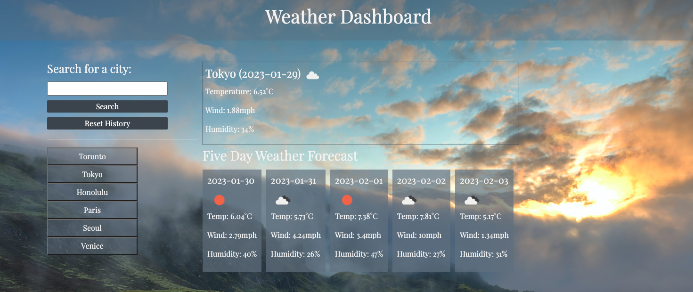

# Weather Dashboard

## Description

This application is for travellers to track and see the weather for multiple cities at a time.

## Installation

N/A

## Usage

The deployed webpage can be accessed [here](https://phoenixouyang.github.io/weather-dashboard/).

In the search bar, enter a valid city that you wish to display weather information for. In the large box at the top, the current weather will display, with information about temperature, wind and humidity. Below, the weather for the next five days will be displayed. 

Your searches will also be saved on the left bar. You can enter up to 6 cities, and it will be saved on the left for your reference. Click the 'Reset History' button to clear your search history. 

## Credits

N/A

## License

Please refer to the LICENSE in the repo.
